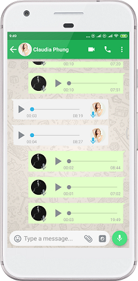
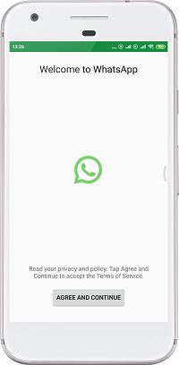

# WhattsApp Clone Demo

This project is all about the design. With this project I try to make a similar UI and add some features of the popular messaging App *Whatsapp.*

Also I tried to develop some of the functionality from the application too (eg. audio recorder).

I used parse server for login and registration, but I had plans to port the login and registration to Firebase authentication and as online database.
   

# Key features
* 
<b>Voice record and send</b>
* 
<b>Message send</b>
* 
<b>Animations</b>
* 
<b>Camera feature</b>
* 
<b>Parse Server</b>
* 
<b>Database for Offline Caching</b>
  
   
   
  
# Screenshots

 
 In app real images.
 
 
### Image credits
#### The persons used in the images are for demonstration purposes only. Models downloaded from [Unsplash.com](https://unsplash.com/) 

   
   
  
# Libraries Used
 * 
<b>Room</b> - Caching the network data for offline use.
 
 * 
<b>RecyclerView </b> - Display list and handle clicks.

 * 
<b>Glide</b> - Image Loading.

 * 
<b>Circular ImageView</b> - Display round images.
 
   
  
# Non-Goals
  
The main focus of this project was on developing the UI design and some key-features.

  
In this moment there is no updates for the current app planned.

   
   
   
   
   
  
## Disclaimer
###### All the code was developed and written by me. This project is developed only for personal use.
###### I don't own the Logo and Trademark.
